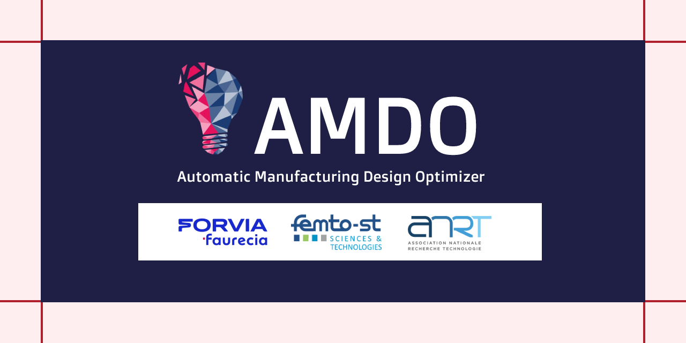
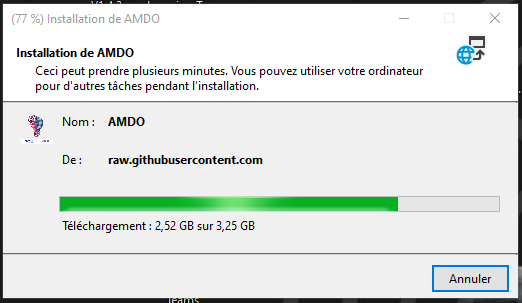

 <!-- Improved compatibility of back to top link: See: https://github.com/othneildrew/Best-README-Template/pull/73 -->

<!--
*** Thanks for checking out the Best-README-Template. If you have a suggestion
*** that would make this better, please fork the repo and create a pull request
*** or simply open an issue with the tag "enhancement".
*** Don't forget to give the project a star!
*** Thanks again! Now go create something AMAZING! :D
-->

<!-- PROJECT SHIELDS -->
<!--
*** I'm using markdown "reference style" links for readability.
*** Reference links are enclosed in brackets [ ] instead of parentheses ( ).
*** See the bottom of this document for the declaration of the reference variables
*** for contributors-url, forks-url, etc. This is an optional, concise syntax you may use.
*** https://www.markdownguide.org/basic-syntax/#reference-style-links
-->

<!-- PROJECT LOGO -->
 

  

  <h3 align="center"> Automatic Manufacturing Design Optimizer</h3>

[![LinkedIn][latestrelease-url]][latestrelease-url]
[![LinkedIn][downloads-shield]][latestrelease-url]
[![LinkedIn][size-shield]][latestrelease-url]

  

     
    <a href="https://github.com/anasselhoud/AMDO/docs"><strong>Explore the docs »</strong></a>
     
     
    <a href="https://github.com/anasselhoud/AMDO/demo">View Demo</a>
    ·
    <a href="https://github.com/anasselhoud/AMDO/issues">Report Bug</a>
    ·
    <a href="hhttps://github.com/anasselhoud/AMDO/issues">Request Feature</a>
  

<!-- TABLE OF CONTENTS -->

  
Table of Contents

  <ol>
    <li>
      <a href="#about-the-project">About The Project</a>
      <ul>
        <li><a href="#built-with">Built With</a></li>
      </ul>
    </li>
    <li>
      <a href="#getting-started">Related Papers</a>
      <ul>
        <li><a href="#prerequisites">Prerequisites</a></li>
        <li><a href="#installation">Installation</a></li>
      </ul>
    </li>
    <li><a href="#usage">Usage</a></li>
    <li><a href="#roadmap">Roadmap</a></li>
    <li><a href="#contributing">Contributing</a></li>
    <li><a href="#license">License</a></li>
    <li><a href="#contact">Contact</a></li>
    <li><a href="#acknowledgments">Acknowledgments</a></li>
  </ol>

<!-- ABOUT THE PROJECT -->
## About The Project

[![Product Name Screen Shot][product-screenshot]](https://example.com)

AMDO is an end-to-end framework that helps Manufacturing Architects and Managers to design an assembly line efficiently stating from a well defined product.  This tool  allows manufacturers to quickly and easily explore different assembly lines and identify the most efficient option. The tool also provides detailed analytics and visualizations to help manufacturers understand the impact of different task/workstation assignments on assembly time, productivity, and cost.

AMDO is designed to work in tandem with traditional design software such as TIGER,  using complex algorithms to optimize assembly line layouts and identify inefficiencies. By simulating the assembly process, AMDO can highlight potential bottlenecks and modify the task/workstation assignement to improve the overall workflow.

One of the key benefits of AMDO is its ability to generate fastly multiple scenarios, allowing designers to quickly compare different layouts and identify the most efficient option. This saves time and money, as designers no longer have to manually test each layout.
It provides several features, including:

- Designing manually assembly lines by defining their layouts and assembly scenarios.
- Simulating a assembly line and obtaining its KPIs: global cycle time, load balancing, and weight carried by workers.
- Auto-generating new optimized assembly scenarios based on the chosen criteras and respecting all precedence constraints, manufacturing rules and security.
- Providing detailed analytics and reporting features to track production metrics such as cycle time and load balancing.

The tool is designed to make it easier to share ideas and work together to create an optimal assembly line layout.

(<a href="#readme-top">back to top</a>)

### Built With

The major programming languages, frameworks/libraries used to bootstrap this project are: 

* [![React][cpp]][React-url]
* [![Vue][csharp]][Vue-url]
* [![Next][python]][Next-url]
* [![Vue][dotnet]][Vue-url]

(<a href="#readme-top">back to top</a>)

<!-- GETTING STARTED -->
## Related Papers

- ### **Swarm Intelligence-Based Framework for Optimized Assembly Line Design: Enhancing Efficiency and Productivity in the Automotive Industry**.
    El Houd, A., Benoit, P., Painvin L., Bourgeois, J. (2023).  Under submission process. 
   

- ### **ManufactSim: Manufacturing Line Simulation Using Heterogeneous Distributed Robots**.
    Piranda, B., Gautam, I., Meyer, J., El Houd, A., Bourgeois, J. (2022).  In: Barolli, L., Hussain, F., Enokido, T. (eds) Advanced Information Networking and Applications. AINA 2022. Lecture Notes in Networks and Systems, vol 450. Springer, Cham. https://doi.org/10.1007/978-3-030-99587-4_12
   

## Installation

1. Download [the setup file.](https://anasselhoud.github.io/AMDO/setup.exe)
2. Install the tool by launching the setup file.

    

3. Follow the steps...
TBC

(<a href="#readme-top">back to top</a>)

<!-- USAGE EXAMPLES -->
## Usage

Use this space to show useful examples of how a project can be used. Additional screenshots, code examples and demos work well in this space. You may also link to more resources.

_For more examples, please refer to the [Documentation](https://example.com)_

(<a href="#readme-top">back to top</a>)

<!-- ROADMAP -->
## Roadmap

- [x] Add Changelog
- [x] Add back to top links
- [ ] Add Additional Templates w/ Examples
- [ ] Add "components" document to easily copy & paste sections of the readme
- [ ] Multi-language Support
    - [ ] Chinese
    - [ ] Spanish

See the [open issues](https://github.com/othneildrew/Best-README-Template/issues) for a full list of proposed features (and known issues).

(<a href="#readme-top">back to top</a>)

<!-- LICENSE -->
## License

The tool has been initially developed as part of a PhD thesis by Anass ELHOUD , under the supervision of Prof. Julien Bourgeois in collaboration between FEMTO-ST Institute and FORVIA.

<!-- CONTACT -->
## Contact

Anass ELHOUD - [@anasselhoud](https://twitter.com/AnassElHoud) - aelhoud.me

Project Link: [https://github.com/anasselhoud/AMDO](https://github.com/anasselhoud/AMDO)

(<a href="#readme-top">back to top</a>)

<!-- ACKNOWLEDGMENTS -->
## Acknowledgments

Use this space to list resources you find helpful and would like to give credit to. I've included a few of my favorites to kick things off!

* [Choose an Open Source License](https://choosealicense.com)
* [GitHub Emoji Cheat Sheet](https://www.webpagefx.com/tools/emoji-cheat-sheet)
* [Malven's Flexbox Cheatsheet](https://flexbox.malven.co/)
* [Malven's Grid Cheatsheet](https://grid.malven.co/)
* [Img Shields](https://shields.io)
* [GitHub Pages](https://pages.github.com)
* [Font Awesome](https://fontawesome.com)
* [React Icons](https://react-icons.github.io/react-icons/search)

(<a href="#readme-top">back to top</a>)

<!-- MARKDOWN LINKS & IMAGES -->
<!-- https://www.markdownguide.org/basic-syntax/#reference-style-links -->

[Windows]: https://img.shields.io/badge/Windows-0078D6?style=for-the-badge&logo=windows&logoColor=white
[python]: https://img.shields.io/badge/Python-3776AB?style=for-the-badge&logo=python&logoColor=white

[dotnet]: https://img.shields.io/badge/.NET-5C2D91?style=for-the-badge&logo=.net&logoColor=white

[Cpp]: https://img.shields.io/badge/C%2B%2B-00599C?style=for-the-badge&logo=c%2B%2B&logoColor=white
[csharp]: https://img.shields.io/badge/C%23-239120?style=for-the-badge&logo=c-sharp&logoColor=white
[contributors-shield]: https://img.shields.io/github/contributors/othneildrew/Best-README-Template.svg?style=for-the-badge
[contributors-url]: https://github.com/othneildrew/Best-README-Template/graphs/contributors
[forks-shield]: https://img.shields.io/github/forks/othneildrew/Best-README-Template.svg?style=for-the-badge
[forks-url]: https://github.com/othneildrew/Best-README-Template/network/members
[stars-shield]: https://img.shields.io/github/stars/othneildrew/Best-README-Template.svg?style=for-the-badge
[stars-url]: https://github.com/othneildrew/Best-README-Template/stargazers
[issues-shield]: https://img.shields.io/github/issues/othneildrew/Best-README-Template.svg?style=for-the-badge
[issues-url]: https://github.com/othneildrew/Best-README-Template/issues
[license-shield]: https://img.shields.io/github/license/othneildrew/Best-README-Template.svg?style=for-the-badge
[license-url]: https://github.com/othneildrew/Best-README-Template/blob/master/LICENSE.txt
[linkedin-shield]: https://img.shields.io/badge/-LinkedIn-black.svg?style=for-the-badge&logo=linkedin&colorB=555
[linkedin-url]: https://linkedin.com/in/othneildrew
[product-screenshot]: images/screenshot.png
[Next.js]: https://img.shields.io/badge/next.js-000000?style=for-the-badge&logo=nextdotjs&logoColor=white
[Next-url]: https://nextjs.org/
[React.js]: https://img.shields.io/badge/React-20232A?style=for-the-badge&logo=react&logoColor=61DAFB
[React-url]: https://reactjs.org/
[Vue.js]: https://img.shields.io/badge/Vue.js-35495E?style=for-the-badge&logo=vuedotjs&logoColor=4FC08D
[Vue-url]: https://vuejs.org/
[Angular.io]: https://img.shields.io/badge/Angular-DD0031?style=for-the-badge&logo=angular&logoColor=white
[Angular-url]: https://angular.io/
[Svelte.dev]: https://img.shields.io/badge/Svelte-4A4A55?style=for-the-badge&logo=svelte&logoColor=FF3E00
[Svelte-url]: https://svelte.dev/
[Laravel.com]: https://img.shields.io/badge/Laravel-FF2D20?style=for-the-badge&logo=laravel&logoColor=white
[Laravel-url]: https://laravel.com
[Bootstrap.com]: https://img.shields.io/badge/Bootstrap-563D7C?style=for-the-badge&logo=bootstrap&logoColor=white
[Bootstrap-url]: https://getbootstrap.com
[JQuery.com]: https://img.shields.io/badge/jQuery-0769AD?style=for-the-badge&logo=jquery&logoColor=white
[JQuery-url]: https://jquery.com 

[latestrelease-url]: https://img.shields.io/github/release-date-pre/anasselhoud/AMDO
[downloads-shield]: https://img.shields.io/github/downloads-pre/anasselhoud/AMDO/v0.1.0-alpha/total

[size-shield]: https://img.shields.io/github/repo-size/anasselhoud/AMDO?label=Size
